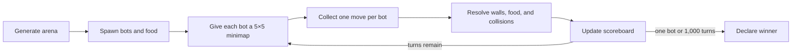

# PacmanWars

**Build a Python bot, give it only a 5×5 view of the arena, and see whether its
strategy can outlast every rival.**

PacmanWars is a game where multiple bots compete in a grid-based environment to collect food and survive. If you want to fight in this game, you can fork the repo and submit the code of your own bot. 


## Features

- Procedurally generated arenas with walkable, mountain, food, and out-of-bounds cells
- Simultaneous competition between independently implemented bot strategies
- Restricted 5×5 observations that reward local planning
- Food-based combat resolution and a live scoreboard
- Adjustable simulation speed and a 1,000-turn match limit

## Create a custom bot

To create a custom bot, follow these steps:

1. Create a new Python file in the [`bots`](./bots) directory with any valid name.
2. Define a new class that inherits from the `Bot` class (Keep the class name as your github username).
3. Implement the **move** method.
4. See the reference bots **basic_bot1.py** and **basic_bot2.py**.
5. Use this reference code below to write your new bot.

Example:
```python
from bots.bot import Bot

class CustomBot(Bot):
    def __init__(self, id: int, start_x: int, start_y: int, minimap: list, map_length: int, map_breadth: int):
        super().__init__(id, start_x, start_y, minimap, map_length, map_breadth)

    def move(self, current_x, current_y, minimap, bot_food):
        self.update_state(current_x, current_y, minimap, bot_food)
        # Implement your bot's strategy here
        return direction
```

## Installation

1. Clone the repository:
    ```sh
    git clone https://github.com/xzaviourr/PacmanWars.git
    cd PacmanWars
    ```

2. Create a virtual environment and activate it:
    ```sh
    python -m venv pacmanwars-env
    pacmanwars-env\Scripts\activate  # On Windows
    source pacmanwars-env/bin/activate  # On macOS/Linux
    ```

3. Install the required dependencies:
    ```sh
    pip install -r requirements.txt
    ```

## Usage

1. Run the game:
    ```sh
    python main.py
    ```

2. Watch the bots compete and collect food. The scoreboard on the right side of the screen shows the current standings.

## How a match works



## Project Structure

- [main.py](https://github.com/xzaviourr/PacmanWars/blob/master/main.py): The main entry point for the game.
- [constants.py](https://github.com/xzaviourr/PacmanWars/blob/master/constants.py): Contains game constants and configurations.
- [map_generator.py](https://github.com/xzaviourr/PacmanWars/blob/master/modules/map_generator.py): Generates the game map.
- [food_generator.py](https://github.com/xzaviourr/PacmanWars/blob/master/modules/food_generator.py): Generates food on the map.
- [bot_operations.py](https://github.com/xzaviourr/PacmanWars/blob/master/modules/bot_operations.py): Contains functions for bot movements and interactions.
- [bots](https://github.com/xzaviourr/PacmanWars/tree/master/bots): Directory containing bot implementations.
- [readme.md](https://github.com/xzaviourr/PacmanWars/blob/master/readme.md): This file.

## Rules
This is a last man standing game. **Your bot needs to kill all the other bots to win the game**. To kill any other bot, your bot needs to cross that bot or be in the same cell as the other bot. When two or more bots are in the same cell, bot with the maximum amount of food wins the battle and collect food from all the dead bots.

Food will keep on spawning across the map. In each turn bot can move in either of the 4 directions or does not move at all. Bots can collect food from the food cells (Blue colored). Bots cannot move in the red (MOUNTAIN_CELL) and black (OUT_OF_BOUNDS_CELL) cells. After each turn, bot will be provided with a **5x5 minimap** based on which the bot needs to decide its next move. Total number of moves is 1000. After 1000 moves, player with most amount of food will be the winner.

Types of cells -
- WALKABLE CELL : Green colored, bot can move in this
- FOOD CELL : Blue colored, bot can move into this cell and eat the food
- MOUNTAIN CELL : Red colored, bot cannot move in this cell
- OUT_OF_BOUNDS_CELL : Black colored, these are not part of the map
- Numbered cell : Other bot is standing in this cell

Types of bot movement -
- MOVE_LEFT : bot moves 1 cell to the left
- MOVE_RIGHT : bot moves 1 cell to the right
- MOVE_UP : bot moves 1 cell up
- MOVE_DOWN : bot moves 1 cell down
- MOVE_HALT : bot does not move

## Validation

There is no automated test suite yet. A lightweight syntax check is:

```bash
python -m compileall -q main.py constants.py modules bots
```

Run `python main.py` for integration validation because map rendering and game
input depend on a graphical display.

## Project status and limitations

PacmanWars is a playable community project rather than a networked tournament
service. Matches run locally, bot code executes in the same Python process, and
submitted bots are **not sandboxed**. Review third-party bot code before
running it. Random maps and food placement make outcomes nondeterministic
unless the code is adapted to control its random seed.

## Contributing

Fork the repository, add your bot without changing the engine, test a complete
local match, and open a pull request describing the strategy. Never include
credentials or machine-specific files.

## License

No repository-wide license has been declared. Copyright remains with the
respective contributors; contact the maintainers before reusing or
redistributing the code.